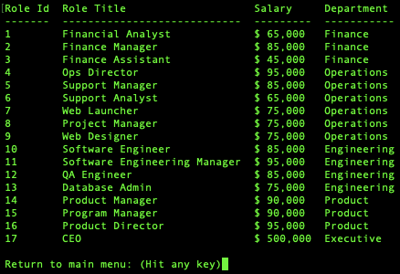

# 12 Command-Line SQL App: Employee Manager
[](https://www.gnu.org/licenses/gpl-3.0)

## Description
This is a command-line app to manage departments, roles, employees and managers in a simple SQL database. This app uses prepared SQL statements and connects to a local MySQL database.

## Table of Contents
* [Installation](#Installation)
* [Usage](#Usage)
* [Code](#Code)
* [License](#License)
* [Test instructions](#Test-Instructions)
* [Questions](#Questions)

## Installation
This app uses [MYSQL2](https://www.npmjs.com/package/mysql2), [INQUIRER](https://www.npmjs.com/package/inquirer), and [CONSOLE.TABLE](https://www.npmjs.com/package/console.table). 

```
npm install mysql2 inquirer console.table --save
```

## Usage
The application runs on the command line. It will initially display a Main Menu with options to Create, Retrieve, Updated, and Delete data from the Employee Manager database.


### List all departments
This menu will display the results of the following SQL query: 
```
SELECT department_id AS 'Department Id',
    departments.department_name as Department
FROM
    departments;
```


### List all roles
This menu will display the results of the following SQL query:
```
SELECT roles.role_id as 'Role Id',
    roles.role_title as 'Role Title',
    CONCAT('$ ',FORMAT(roles.role_salary,0)) AS Salary,
    departments.department_name as 'Department'
FROM roles
LEFT JOIN departments ON roles.department_id = departments.department_id;
```


### List all employees
This menu will displaye the results of this query:

```
SELECT employees.id as Id, employees.first_name AS 'First Name', employees.last_name AS 'Last Name', 
    roles.role_title AS 'Title',  
    departments.department_name as Department,
    CONCAT('$ ',FORMAT(roles.role_salary,0)) AS Salary,
    CONCAT(managers.first_name, ' ', managers.last_name) AS 'Manager'
FROM
    employees
LEFT JOIN employees AS managers ON managers.id = employees.manager_id
LEFT JOIN roles ON employees.role_id = roles.role_id
LEFT JOIN departments ON roles.department_id = departments.department_id;
```


### Add a department
This menu will prompt the user for the name of a new department. Then, the following prepared insert statement will run:

```
INSERT INTO departments (department_name) 
VALUES ('${department}');
```


After adding the new department, the app will list all departments to confirm new entry was added.

### Add a role
This menu will retrieve all departments, then prompt the user for the name of a new role, the role salary and ask them to select the department on which this new role resides:


The prepared statement looks like this:

```
INSERT INTO roles (role_title, role_salary, department_id) 
VALUES ('${role.role_title}','${role.salary}',${deptId});
```
### Add an employee
This option will as the user for an employee first name, last name, role and manager. This is accomplished by retrieving a list of roles and managers (employees).


### Update employee info (role and manager)
There are two menus to update employee info: one for role, and one for manager. Updating the role, will retrieve a list of roles to display in the screen for users to select. While managers will list all other employees, who can be selected as the employee manager.

### Deleting employees, roles, and departments
These last three menus will display a list of employees, roles, or departments, respectively. Users may select an option to delete, or select "Return back to main menu".

Deleting a role will automatically set all employees with that role with a null on their role_id column. Similarly deleting a department or a manager will auto set null on the department_id and manager_id fields.

[Click here to watch the app in action.](https://drive.google.com/file/d/1G4ZBfywUhgAw-5Dpi5mbBqzm9LoqRBeq/view?usp=sharing)

## Code

### Prepared statements:

#### CREATE:
Method receives ${employee} as an object with first_name and last_name as properties. RoleId and ManagerId come as answers from inquirer prompts:
```
this.database.query(`
    INSERT INTO employees (first_name, last_name, role_id, manager_id) 
    VALUES ('${employee.first_name}','${employee.last_name}',${roleId},${managerId});`,
    function (err,res) {
        if (err) {
            console.log(err);
            return err;
        }
        return callback(res);
    });
```
#### RETRIEVE:
Example of method to retrieve all data (in this case, all Employees):
```
Model.prototype.listAllEmployees = function(callback) {
    console.log(`\n\nRetrieving all employees...\n\n`);
    this.database.query(`
    SELECT employees.id as Id, employees.first_name AS 'First Name', employees.last_name AS 'Last Name', 
        roles.role_title AS 'Title',  
        departments.department_name as Department,
        CONCAT('$ ',FORMAT(roles.role_salary,0)) AS Salary,
        CONCAT(managers.first_name, ' ', managers.last_name) AS 'Manager'
    FROM
        employees
    LEFT JOIN employees AS managers ON managers.id = employees.manager_id
    LEFT JOIN roles ON employees.role_id = roles.role_id
    LEFT JOIN departments ON roles.department_id = departments.department_id;`,
    function (err,res) {
        if (err) {
            console.log(err);
            return err;
        }
        return callback(res);
    });
};
```

#### UPDATE:
Example of update (in this case, updating employee manager):
```
Model.prototype.updateEmployeeManager = function(employee, manager, callback) {
    console.log(`\nUpdating employee: [ ${employee} ]`);
    let id = employee.split(":", 1);
    let managerId = manager.split(":", 1);
    this.database.query(`
    UPDATE employees SET manager_idd = '${managerId}' WHERE (id = '${id}');
    `,
    function (err,res) {
        if (err) {
            console.log(err);
            return err;
        }
        return callback(res);
    });
}
```

#### DELETE:
Prepared statement for department deletion:
```
this.database.query(`
    DELETE FROM departments  
    WHERE department_id = '${id}';`,
    function (err,res) {
        if (err) {
            console.log(err);
            return err;
        }
        return callback(res);
    }
);
```

### Data seeding
The data structure statements and data seeding can be found under ./db/schema.sql and ./db/seed.sql respectively.

To create and seed the database simply run the following commands inside MySQL console, following these steps:

1. Log into MySQL console:
```
/employee-manager % mysql -u root -p

Welcome to the MySQL monitor.  Commands end with ; or \g.
Your MySQL connection id is 368
Server version: 8.0.25 MySQL Community Server - GPL

Copyright (c) 2000, 2021, Oracle and/or its affiliates.

Oracle is a registered trademark of Oracle Corporation and/or its
affiliates. Other names may be trademarks of their respective
owners.

Type 'help;' or '\h' for help. Type '\c' to clear the current input statement.
```
2. Source the schema file:
```
mysql> source ./db/schema.sql
Query OK, 1 row affected, 1 warning (0.01 sec)
Database changed

Query OK, 0 rows affected (0.06 sec)

Query OK, 0 rows affected (0.02 sec)

Query OK, 0 rows affected (0.01 sec)

Query OK, 0 rows affected (0.04 sec)

Query OK, 0 rows affected (0.03 sec)

Query OK, 0 rows affected (0.03 sec)
```

3. Source the seed file:
```
mysql> source ./db/seed.sql
Database changed
Query OK, 5 rows affected (0.00 sec)
Records: 5  Duplicates: 0  Warnings: 0

Query OK, 17 rows affected (0.01 sec)
Records: 17  Duplicates: 0  Warnings: 0

Query OK, 26 rows affected (0.00 sec)
Records: 26  Duplicates: 0  Warnings: 0
```

## Questions
E-mail me: <lou.arnaut@gmail.com>
Checkout my Github profile: [acevezl](https://github.com/acevezl)
